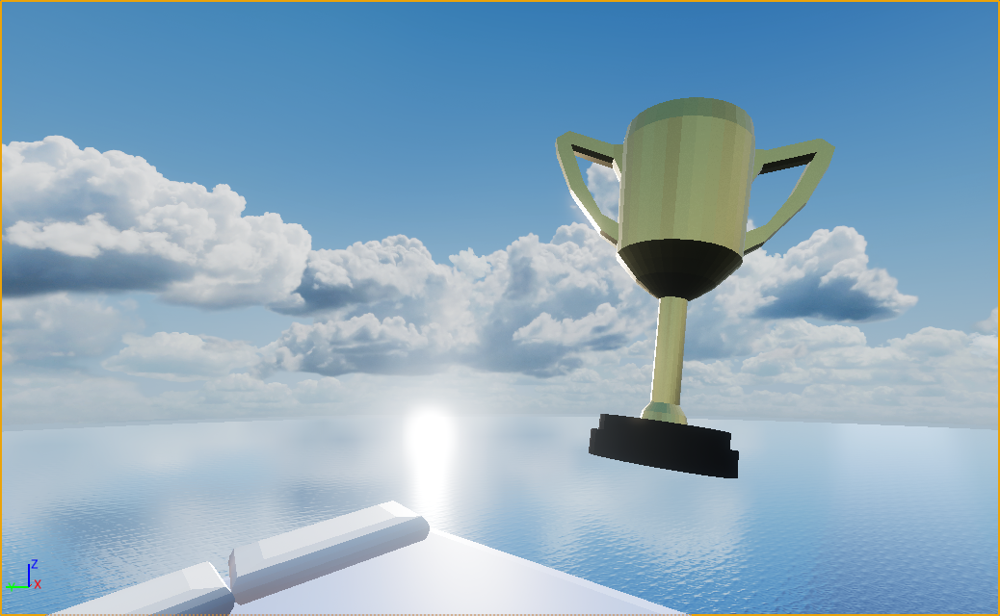

# Sky Bound

&nbsp;&nbsp;&nbsp;&nbsp;Sky Bound is a 3D game inspired by "Only Up!", developed using Unreal Engine 5. The game features immersive environments and challenging gameplay, encouraging players to climb their way to the top. However, one wrong step can mean losing all progress, adding an intense level of difficulty and excitement. 

## Overview
&nbsp;&nbsp;&nbsp;&nbsp;Sky Bound was created as a hands-on project to deepen my understanding of Unreal Engine 5. This journey allowed me to explore the engine’s powerful tools and plugins, focusing on building immersive environments and integrating various assets.

## Features
- **Immersive 3D Environments**: Traverse through stunningly arranged objects and landscapes that present unique and extraordinary challenges.
- **Integrated Assets**: Utilized high-quality plugins from the Unreal Engine asset store, including:
  - **Advanced Locomotion System**: For smooth and realistic character movement.
  - **Sky and Texture Assets**: To enhance visual quality and create captivating, atmospheric environments.
- **Custom 3D Models**: Crafted multiple original 3D models to populate the game world, adding a personal touch to the game’s design.

## Development Goals
- **Unreal Engine 5 Proficiency**: The primary goal was to gain familiarity with Unreal Engine's interface, tools, and capabilities.
- **Asset Integration and Plugin Experimentation**: Explored various Unreal Engine Marketplace plugins to understand their functionality and effective integration.
- **3D Modeling Practice**: Created custom 3D models to enhance the game’s environment and refine my modeling skills.

## Screenshots
&nbsp;&nbsp;&nbsp;&nbsp;Here are some in-game screenshots showcasing the environment and gameplay:

    
    
    
    
    
    
    

## Demo Video
🎮 **[Watch the Demo on YouTube!](https://youtu.be/VZNoz_729pg)** 🎥

## Credits
- **Development**: [ShiroRinS](https://github.com/ShiroRinS)
- **Assets and Plugins**: Various assets and plugins from the Unreal Engine Marketplace, including the Advanced Locomotion System, sky, and texture assets.
- **3D Modeling**: Original models created by me to bring a unique aesthetic to the game world.

## License
&nbsp;&nbsp;&nbsp;&nbsp;This project is intended for educational and portfolio purposes and is not for commercial distribution. All assets from the Unreal Engine Marketplace are used under Epic Games' licensing terms.

---

&nbsp;&nbsp;&nbsp;&nbsp;Sky Bound is a visual exploration and learning project. While coding was minimal, this project provided invaluable experience in environment design and asset integration within Unreal Engine 5.
<!--   -->
